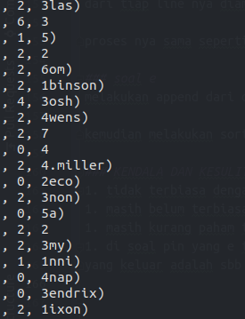

# soal-shift-sisop-modul-1-D03-2020

# LAPORAN PENGERJAAN SOAL SHIFT

# ============== NO 1 ===============

## PENYELESAIAN

```bash
#!/bin/bash

errorFile="error_message.csv"
userFile="user_statistic.csv"

echo ERROR,Count >"$errorFile"
echo Username,INFO,ERROR >"$userFile"

messages=()
messageCount=(0 0 0 0 0 0 0 0 0 0)

getErrorMessage() {
    index=0
    result=""

    # shellcheck disable=SC2068
    for i in $@; do
        index=$(($index + 1))
        if [ $index -ge 8 ] && [ $index -le $1 ]; then
            result="${result} ${i}"
        fi
    done
}

appendAndCount() {
    udahAda=0
    index=0

    for message in "${messages[@]}"; do
        if [ "${message}" = "${result}" ]; then
            udahAda=1
            break
        fi
        index=$(($index + 1))
    done

    if [ $udahAda -eq 0 ]; then
        messages+=("${result}")
    fi

    messageCount[index]=$((${messageCount[index]} + 1))
}

grep ERROR ~/Documents/ITS/sisop/seslab1/_soalShift/soal1/syslog.log | while read line; do
    count=$(echo "$line" | wc -w)

    getErrorMessage $count "$line"
    appendAndCount

    #write
    index=0
    for message in "${messages[@]}"; do
        printf "${message}, ${messageCount[index]}\n" >>"$errorFile"
        index=$(($index + 1))
    done
done

sed -i $errorFile -re '2,362d'

echo 'x' | ex -s -c '2,$!sort -t"," -r -n -k2 -k1' $errorFile

names=()
errorCount=(0 0 0 0 0 0 0 0 0 0 0 0 0 0 0 0 0 0 0 0 0 0 0)
infoCount=(0 0 0 0 0 0 0 0 0 0 0 0 0 0 0 0 0 0 0 0 0 0 0)

appendNameAndCount() {
    udahAda=0
    index=0

    for item in "${names[@]}"; do
        if [ "${item}" = "${1}" ]; then
            udahAda=1
            break
        fi
        index=$(($index + 1))
    done

    if [ $udahAda -eq 0 ]; then
        names+=("${1}")
    fi

    if [ "${2}" = "ERROR" ]; then
        errorCount[index]=$((${errorCount[index]} + 1))
    elif [ "${2}" = "INFO" ]; then
        infoCount[index]=$((${infoCount[index]} + 1))
    fi
}

getUsername() {
    index=0
    name=""
    for i in $@; do
        index=$(($index + 1))
        if [ $index -gt $1 ]; then
            name="${i}"
        fi

        if [ $index -gt 6 ] && [ $index -le 7 ]; then
            type=$i
        fi
    done
}

cat ~/Documents/ITS/sisop/seslab1/_soalShift/soal1/syslog.log | while read line; do
    count=$(echo "$line" | wc -w)

    getUsername $count "$line"
    appendNameAndCount ${name##*( \(\)} $type

    index=0
    printf "=========================================\n" >>"$userFile"
    for item in "${names[@]}"; do
        printf "${item}, ${infoCount[index]}, ${errorCount[index]}\n" >>"$userFile"
        index=$(($index + 1))
    done
done

sed -i $userFile -re '2,1749d'
echo 'x' | ex -s -c '2,$!sort' $userFile

```

## DESKRIPSI

### soal a

Dari Soal nomor 1 Penyelesaian dimulai dari yang problem yang paling dasar yaitu membaca setiap line dari syslog.log

### soal b

penyelesaian dari poin (b) dilakukan dengan cara mencari semua line yang mengandung kata ERROR menggunakan fungsi grep.

dari pola setiap line, data dari message bisa di dapat dengan mengambil karakter ke 8 sampai dengan (jumlah katata -1)

kemudian dari setiap pesan yang didapat di lakukan check apakah sudah di push ke dalam array, jika belum maka tinggal di
tambahkan

jika ada pesan yang sama maka counter dari setiap pesan di tambahkan

### soal d

kemudian yang dilakukan selanjutnya adalah me-append info yang di dapat ke file error_message.csv

dari file csv hal selanjutya yang dilakukan adalah membersihkan line yang tidak perlu dan sorting berdasarkan kolom ke 2

### soal c

di soal c yang dilakukan adalah iterasi ke semua line syslog dengan command cat

dari tiap line nya diambil nama dan tipe dari log nya "ERROR" / "INFO"

proses nya sama seperti poin B melakukan check pada tiap nama dan append jika tidak ada, jika ada menambah counter "
ERROR" / "INFO"

### soal e

melakukan append dari data yang diperoleh kemudian membersihkan line yang tidak perlu.

kemudian melakukan sorting

### KENDALA DAN KESULITAN

1. tidak terbiasa dengan syntax yang aneh apalagi menggunakan regex
1. masih belum terbiasa dengan kemampuan dari tiap command
1. masih kurang paham tentang scope yang ada di dalam shell
1. di soal pin yang e timbul behaviour aneh dari command yang dijalankan, sepertinya trailing whitespace tapi jika
   dilakukan cat command yang keluar adalah sbb

   


# ============== NOMER 2 ===============

## Script📄

```bash
#!/bin/bash

#untuk 2a
awk -F '\t' 'NR>1 {costprice=$18-$21; profper=($21/costprice)*100; print $1, profper}' Laporan-TokoShiSop.tsv > datafull.txt
awk 'BEGIN {max=0;idne=0}{if($2>max) max=$2}{if($2==max) idne=$1} END {print "Transaksi terakhir dengan profit percentage terbesar yaitu ",idne," dengan persentase ", max}' datafull.txt >> hasil.txt

#untuk 2b
awk -F '\t' 'NR>1 {OFS="-"; print $1,$3,$7}' Laporan-TokoShiSop.tsv > data2b.txt
awk -F '-' 'BEGIN {print "Daftar nama customer di Albuquerque pada tahun 2017 antara lain"} {if($4==17) print $5} END {print "----------------------\n"}' data2b.txt >> hasil.txt

#untuk 2c
awk -F '\t' 'NR>1 {if($8=="Consumer") print $1, $18}' Laporan-TokoShiSop.tsv > trydataconsumer.txt
awk -F '\t' 'NR>1 {if($8=="Corporate") print $1, $18}' Laporan-TokoShiSop.tsv > trydatacorporate.txt
awk -F '\t' 'NR>1 {if($8=="Home Office") print $1, $18}' Laporan-TokoShiSop.tsv > trydatahome.txt

awk '{sum+=$2} END {print "consumer ", sum}' trydataconsumer.txt >> trycekhasil.txt
awk '{sum+=$2} END {print "corporate ", sum}' trydatacorporate.txt >> trycekhasil.txt
awk '{sum+=$2} END {print "home ", sum}' trydatahome.txt >> trycekhasil.txt

awk 'BEGIN {min=9999999999; segment="sg"} {if($2<min) min=$2}{if($2==min) segment=$1} END {print "Tipe segmen customer yang penjualannya paling sedikit adalah ",segment," dengan ",min, " transaksi"}' trycekhasil.txt >> hasil.txt

#untuk 2d
awk -F '\t' 'NR>1 {if($13=="South") print $13, $21}' Laporan-TokoShiSop.tsv > trysouthprofit.txt
awk -F '\t' 'NR>1 {if($13=="West") print $13, $21}' Laporan-TokoShiSop.tsv > trywestprofit.txt
awk -F '\t' 'NR>1 {if($13=="Central") print $13, $21}' Laporan-TokoShiSop.tsv > trycentralprofit.txt
awk -F '\t' 'NR>1 {if($13=="East") print $13, $21}' Laporan-TokoShiSop.tsv > tryeastprofit.txt

awk '{jumlah+=$2} END {print "South ",jumlah}' trysouthprofit.txt >> trysegprofit.txt
awk '{jumlah+=$2} END {print "West ", jumlah}' trywestprofit.txt >> trysegprofit.txt
awk '{jumlah+=$2} END {print "Central ",jumlah}' trycentralprofit.txt >> trysegprofit.txt
awk '{jumlah+=$2} END {print "East ",jumlah}' tryeastprofit.txt >> trysegprofit.txt

awk 'BEGIN {minpro=9999999999; reg="rg"} {if($2<minpro) minpro=$2}{if($2==minpro) reg=$1} END {print "Wilayah bagian (region) yang memiliki total keuntungan (profit) yang paling sedikit adalah ", reg, " dengan total keuntungan ",minpro}' trysegprofit.txt >> hasil.txt

```

## Penjelasan 📗 

### 2a
```bash
#!/bin/bash

#untuk 2a
awk -F '\t' 'NR>1 {costprice=$18-$21; profper=($21/costprice)*100; print $1, profper}' Laporan-TokoShiSop.tsv > datafull.txt
awk 'BEGIN {max=0;idne=0}{if($2>max) max=$2}{if($2==max) idne=$1} END {print "Transaksi terakhir dengan profit percentage terbesar yaitu ",idne," dengan persentase ", max}' datafull.txt >> hasil.txt
```
Pada nomer 2a, cara yang kami gunakan adalah pencarian cost price pada setiap record, setelah itu data tersebut di outpatkan ke sebuah file.txt yang kemudian menjadi input untuk diproses dalam pencarian record yang memiliki profit terbesar. Lalu hasil teresbut dicetak atau dijadikan output ke hasil.txt


### 2b
```bash
#!/bin/bash

#untuk 2b
awk -F '\t' 'NR>1 {OFS="-"; print $1,$3,$7}' Laporan-TokoShiSop.tsv > data2b.txt
awk -F '-' 'BEGIN {print "Daftar nama customer di Albuquerque pada tahun 2017 antara lain"} {if($4==17) print $5} END {print "----------------------\n"}' data2b.txt >> hasil.txt

```
Untuk nomer 2b, pengerjaan dimulai dengan pengolahan data dari Laporan-TokoShiShop.tsv yang bertujuan untuk memilah data dengan mendapatkan transaksi yang terjadi di tahun 2017, lalu hasil pengolahan tersebut dijadikan output ke hasil.txt


### 2c
```bash
#!/bin/bash

#untuk 2c
awk -F '\t' 'NR>1 {if($8=="Consumer") print $1, $18}' Laporan-TokoShiSop.tsv > trydataconsumer.txt
awk -F '\t' 'NR>1 {if($8=="Corporate") print $1, $18}' Laporan-TokoShiSop.tsv > trydatacorporate.txt
awk -F '\t' 'NR>1 {if($8=="Home Office") print $1, $18}' Laporan-TokoShiSop.tsv > trydatahome.txt

awk '{sum+=$2} END {print "consumer ", sum}' trydataconsumer.txt >> trycekhasil.txt
awk '{sum+=$2} END {print "corporate ", sum}' trydatacorporate.txt >> trycekhasil.txt
awk '{sum+=$2} END {print "home ", sum}' trydatahome.txt >> trycekhasil.txt

awk 'BEGIN {min=9999999999; segment="sg"} {if($2<min) min=$2}{if($2==min) segment=$1} END {print "Tipe segmen customer yang penjualannya paling sedikit adalah ",segment," dengan ",min, " transaksi"}' trycekhasil.txt >> hasil.txt

```
Nomer 2c dikerjakan dengan memilih record dari setiap segment kemudian dijadikan output pada sebuah file, kemudian file tersebut dijadikan input untuk dijumlahkan fieldnya yang mengandung nilai transaksi, setelah itu hasilnya di outputkan ke sebuah txt yang kemudian file tersebut di ouputkan lagi ke hasil.txt


### 2d
```bash
#!/bin/bash

#untuk 2d
awk -F '\t' 'NR>1 {if($13=="South") print $13, $21}' Laporan-TokoShiSop.tsv > trysouthprofit.txt
awk -F '\t' 'NR>1 {if($13=="West") print $13, $21}' Laporan-TokoShiSop.tsv > trywestprofit.txt
awk -F '\t' 'NR>1 {if($13=="Central") print $13, $21}' Laporan-TokoShiSop.tsv > trycentralprofit.txt
awk -F '\t' 'NR>1 {if($13=="East") print $13, $21}' Laporan-TokoShiSop.tsv > tryeastprofit.txt

awk '{jumlah+=$2} END {print "South ",jumlah}' trysouthprofit.txt >> trysegprofit.txt
awk '{jumlah+=$2} END {print "West ", jumlah}' trywestprofit.txt >> trysegprofit.txt
awk '{jumlah+=$2} END {print "Central ",jumlah}' trycentralprofit.txt >> trysegprofit.txt
awk '{jumlah+=$2} END {print "East ",jumlah}' tryeastprofit.txt >> trysegprofit.txt

awk 'BEGIN {minpro=9999999999; reg="rg"} {if($2<minpro) minpro=$2}{if($2==minpro) reg=$1} END {print "Wilayah bagian (region) yang memiliki total keuntungan (profit) yang paling sedikit adalah ", reg, " dengan total keuntungan ",minpro}' trysegprofit.txt >> hasil.txt

```
Proses pengerjaan 2d dimulai dengan pemrosesan record dari setiap region, kemudian dari hasil pemroesan setiap ssegment tersebut disimpan ke sebuah file txt yang kemudian digunakan untuk diproses kembali dalam pencarian nilai profit paling sedikit beserta nama regionnya, hasil pemrosesan di outputkan ke hasil.txt

### 2e
Pada penampilan hasil.txt yang ditunjukkan pada soal 2e, didapat dari proses 2a,2b,2c,2d yang sudah diusakan untuk dikondisikan sedemikian hingga seperti hasil.txt


## Kekurangan dan Kendala🚑
1. Cara yang digunakan belum optimal
2. Terdapat output yang belum sesuai
3. Belum mengerti sepenuhnya dalam penggunaan perintah awk


# ============== NOMER 3 ===============

### 3a
```bash
#!/bin/bash

{
for ((i=1; i<24; i=i+1))
do
    if [ $i -lt 10 ]
    then
        wget -c https://loremflickr.com/320/240/kitten -O Koleksi_0$i
    else
        wget -c https://loremflickr.com/320/240/kitten -O Koleksi_$i
    fi
done

declare -A filecksums

test 0 -eq $# && set -- *

for file in "$@"
do
    [[ -f "$file" ]] && [[ ! -h "$file" ]] || continue

    cksum=$(cksum <"$file" | tr ' ' _)

    if [[ -n "${filecksums[$cksum]}" ]] && [[ "${filecksums[$cksum]}" != "$file" ]]
    then
        echo "Found '$file' is a duplicate of '${filecksums[$cksum]}'" >&2
        rm -f "$file"
    else
        filecksums[$cksum]="$file"
    fi
done
} 2>Foto.log
```
Karena di soal diminta untuk mendownload 23 gambar, maka dibuat loop terlebih dahulu. Lalu pada setiap iterasi download file. Kemudian dari foto-foto yang sudah di-download, dicari apakah ada yang sama dengan cara membandingkannya. Jika sama, maka salah satu foto dihapus. Kemudian output dari script disimpan di Foto.log

### 3b
```bash
#!/bin/bash

TGL_NOW="$(date +"%d-%m-%Y")"
mkdir "$TGL_NOW"
cd "$TGL_NOW"

{

for ((i=1; i<24; i=i+1))
do
    if [ $i -lt 10 ]
    then
        wget -c https://loremflickr.com/320/240/kitten -O Koleksi_0$i -P /
    else
        wget -c https://loremflickr.com/320/240/kitten -O Koleksi_$i
    fi
done

declare -A filecksums

test 0 -eq $# && set -- *

for file in "$@"
do
    [[ -f "$file" ]] && [[ ! -h "$file" ]] || continue

    cksum=$(cksum <"$file" | tr ' ' _)

    if [[ -n "${filecksums[$cksum]}" ]] && [[ "${filecksums[$cksum]}" != "$file" ]]
    then
        echo "Found '$file' is a duplicate of '${filecksums[$cksum]}'" >&2
        rm -f "$file"
    else
        filecksums[$cksum]="$file"
    fi
done
} 2>Foto.log
```
```bash
0 20 1-31/7 2-31/4 * * cd /home/bagas/SoalShift/ && bash soal3b.sh
```
Pertama buat variabel TGL_NOW untuk menyimpan tanggal sekarang dengan format DD-MM-YYYY. Lalu buat folder dan diberi nama sesuai dengan TGL_NOW. Kemudian ganti directory ke folder yang baru dibuat. Langkah selanjutnya sama seperti soal sebelumnya. Dan terakhir atur cron agar script dapat dijalankan sesuai dengan kehendak soal.

### 3c
```bash
#!/bin/bash


TGL_NOW="$(date +"%d-%m-%Y")"
TGL_YST="$(date -d yesterday +"%d-%m-%Y")"

kelck="$PWD/Kelinci_$TGL_YST"
if [ -d "$kelck" ]
then 
    mkdir "Kucing_$TGL_NOW"
    cd "Kucing_$TGL_NOW"
    {
    for ((i=1; i<24; i=i+1))
    do
        if [ $i -lt 10 ]
        then
            wget -c https://loremflickr.com/320/240/kitten -O Koleksi_0$i
        else
            wget -c https://loremflickr.com/320/240/kitten -O Koleksi_$i
        fi
    done
    } 2>Foto.log
else
    mkdir "Kelinci_$TGL_NOW"
    cd "Kelinci_$TGL_NOW"
    {
    for ((i=1; i<24; i=i+1))
    do
        if [ $i -lt 10 ]
        then
           wget -c https://loremflickr.com/320/240/bunny -O Koleksi_0$i
        else
           wget -c https://loremflickr.com/320/240/bunny -O Koleksi_$i
        fi
    done
    } 2>Foto.log
fi
cd $PWD
{
declare -A filecksums

test 0 -eq $# && set -- *

for file in "$@"
do
    [[ -f "$file" ]] && [[ ! -h "$file" ]] || continue

    cksum=$(cksum <"$file" | tr ' ' _)

    if [[ -n "${filecksums[$cksum]}" ]] && [[ "${filecksums[$cksum]}" != "$file" ]]
    then
        echo "Found '$file' is a duplicate of '${filecksums[$cksum]}'" >&2
        rm -f "$file"
    else
        filecksums[$cksum]="$file"
    fi
done
} 2>>Foto.log
```
Pertama buat 2 variabel untuk menyimpan tanggal hari ini(TGL_NOW) dan kemarin(TGL_YST) dengan format DD-MM-YYYY. Kemudian cek apakah kemarin folder yang dibuat Kelinci atau bukan. Jika iya, maka eksekusi script bagian download gambar kucing. Jika bukan, eksekusi script bagian download gambar kelinci. Langkah-langkahnya mirip dengan soal sebelumnya, buat folder, ganti directory, download gambar, simpan di log, cari gambar yang sama, simpan di log lagi.

### 3d
```bash
#!/bin/bash

TGL_NOW="$(date +"%m%d%Y")"
zip -P $TGL_NOW -rm Koleksi.zip Kucing_??-??-????/* Kelinci_??-??-????/* ??-??-????/*
rm -r Kucing_??-??-????/
rm -r Kelinci_??-??-????/
rm -r ??-??-????/
```
Pertama buat variabel untuk menyimpan tanggal hari ini dengan format MMDDYYYY yang akan digunakan sebagai password nantinya. Lalu gunakan command zip untuk membuat zip -P agar dapat diberi password -rm agar file yang akan di-zip terhapus. File yang akan di-zip adalah folder-folder dengan nama Kucing_..., Kelinci_..., atau DD-MM-YYYY beserta isinya.

### 3e
```bash
0 7 * * 1-5 cd /home/bagas/SoalShift/ && bash soal3d.sh
0 18 * * 1-5 cd /home/bagas/SoalShift/ && unzip -P $(date +"%m%d%Y") Koleksi.zip && rm Koleksi.zip
```
Di soal diminta untuk melakukan zip setiap jam 7 dan un-zip setiap jam 6 sore kecuali hari Sabtu dan Minggu. Maka dibuat cron dengan format seperti di atas.

## Kekurangan dan Kendala🚑
1. Cara yang digunakan belum optimal
2. Pada soal 3e, jika di crontab langsung dijalankan unzip, seringkali tidak jalan. Namun jika unzip ditulis pada sebuah script dan lalu di crontab bash script tersebut, script dapat jalan.
